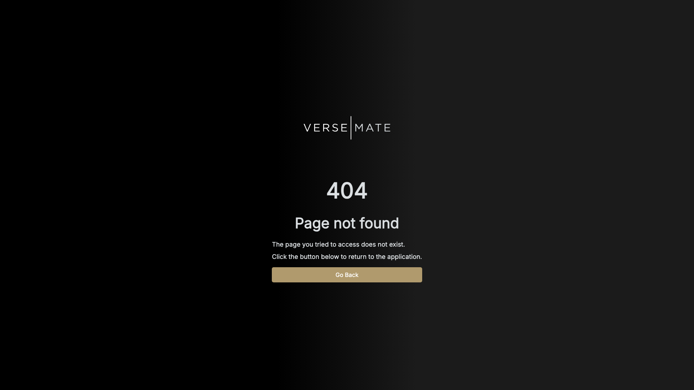
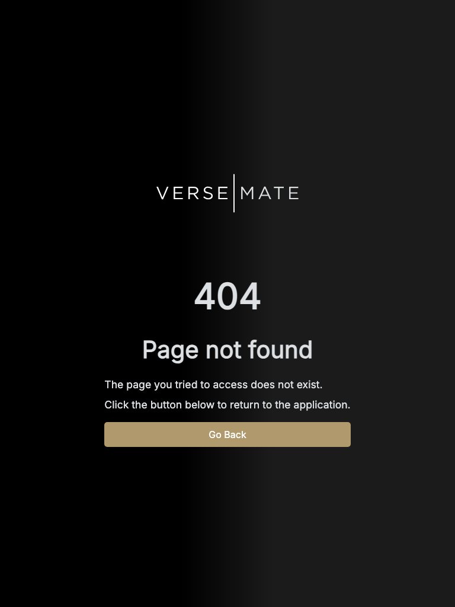
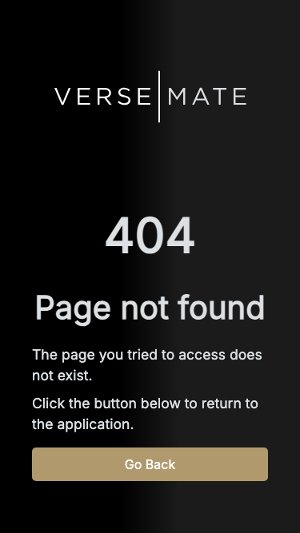

# Visual Reference: Bible Reader

> Captured: 10/5/2025, 11:10:19 PM
> Source: https://app.versemate.org/bible/1/1

## Screenshots

### Desktop


### Tablet


### Mobile


## Typography System

- **body**: system-ui, -apple-system, "Segoe UI", Roboto, Ubuntu, Cantarell, "Noto Sans", sans-serif, "Segoe UI", Roboto, Ubuntu, Cantarell, "Noto Sans", sans-serif, 16px, 400
- **p**: Inter, sans-serif, 17.6px, 500

## Component Structure

```
<body>
  <div>
  <script id="_R_">
  <script>
  <script>
  <script>
  <next-route-announcer>
  <ul class="Notifications_notifications__4CghI">
  <div class="style_background__64n3D">
  <main class="style_container___RvVz">
    <div class="style_content__mhrUd">
      <span class="style_logo__3_3JN">
        <svg>
          <path>
          <path>
          <path>
          <path>
          <path>
          <path>
          <path>
          <path>
          <path>
          <path>
      <div class="style_descriptionContainer__hXt9y">
        <span class="style_statusCode__td7rj">
        <span class="style_statusDescription__Oca8q">
        <div class="style_simpleText__1bNnF">
          <p>
          <p>
        <button class="Button_button__NAbVN Button_soft__CALZd Button_contained__2ECUc style_button__X65Ns">
          <span class="Button_content__q5rqQ">
          <span class="Button_loading__0EAjj">
```

## Key Styles

### `body`

**Typography:**
- Font: system-ui, -apple-system, "Segoe UI", Roboto, Ubuntu, Cantarell, "Noto Sans", sans-serif, "Segoe UI", Roboto, Ubuntu, Cantarell, "Noto Sans", sans-serif
- Size: 16px
- Weight: 400

**Colors:**
- Text: rgb(33, 37, 49)
- Background: rgba(0, 0, 0, 0)

### `p`

**Typography:**
- Font: Inter, sans-serif
- Size: 17.6px
- Weight: 500

**Colors:**
- Text: rgb(220, 224, 227)
- Background: rgba(0, 0, 0, 0)

### `button`

**Typography:**
- Font: Inter, sans-serif
- Size: 16px
- Weight: 500

**Colors:**
- Text: rgb(255, 255, 255)
- Background: rgb(176, 154, 109)

### `main`

**Typography:**
- Font: Inter, sans-serif
- Size: 16px
- Weight: 400

**Colors:**
- Text: rgb(33, 37, 49)
- Background: rgba(0, 0, 0, 0)

