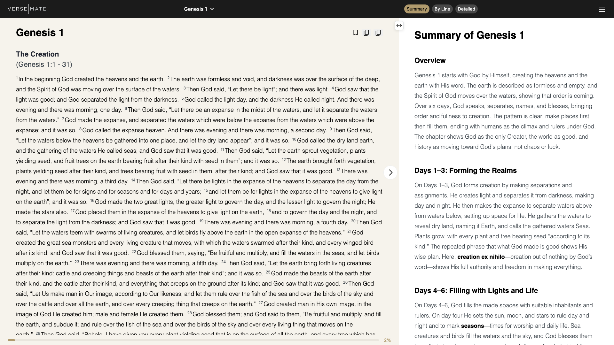
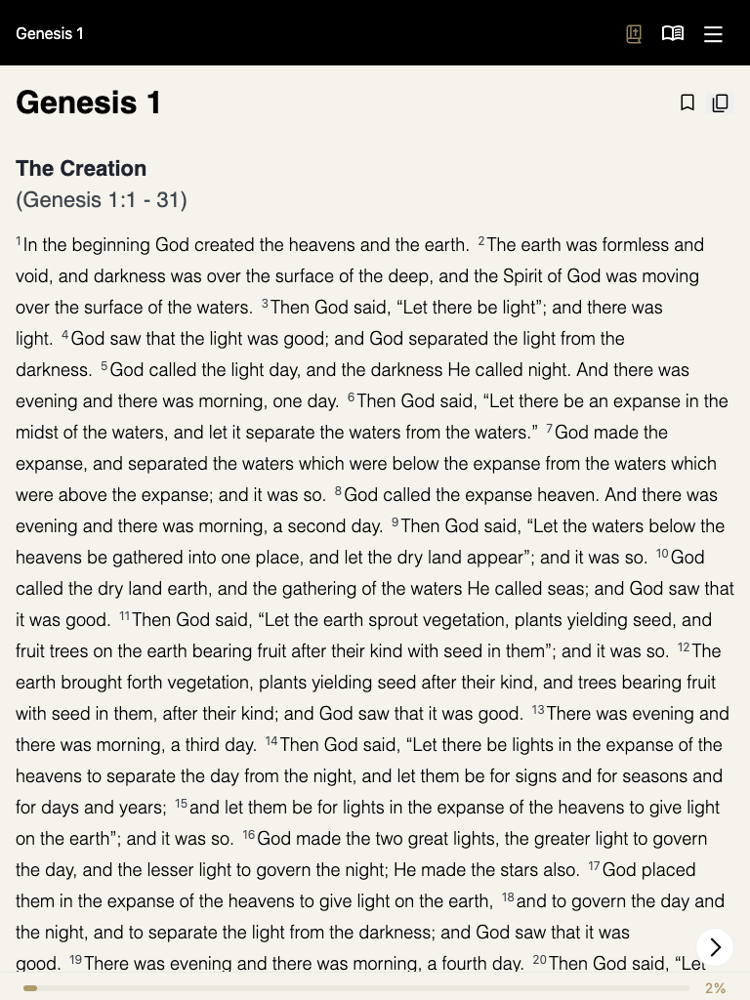
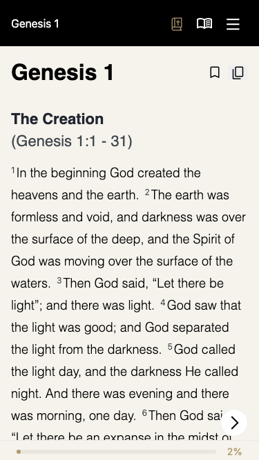

# Visual Reference: Home Page

> Captured: 10/5/2025, 11:41:50 PM
> Source: https://app.versemate.org/

## Screenshots

### Desktop


### Tablet


### Mobile


## Typography System

- **body**: system-ui, -apple-system, "Segoe UI", Roboto, Ubuntu, Cantarell, "Noto Sans", sans-serif, "Segoe UI", Roboto, Ubuntu, Cantarell, "Noto Sans", sans-serif, 16px, 400
- **h1**: MerriweatherItalic, sans-serif, 32px, 700
- **h2**: MerriweatherItalic, sans-serif, 22px, 700
- **p**: MerriweatherItalic, sans-serif, 22px, 400

## Component Structure

```
<body>
  <div>
  <script id="_R_">
  <script>
  <script>
  <script>
  <script>
  <script>
  <script>
  <next-route-announcer>
  <ul class="Notifications_notifications__4CghI">
  ... (2 more children)
```

## Key Styles

### `body`

**Typography:**
- Font: system-ui, -apple-system, "Segoe UI", Roboto, Ubuntu, Cantarell, "Noto Sans", sans-serif, "Segoe UI", Roboto, Ubuntu, Cantarell, "Noto Sans", sans-serif
- Size: 16px
- Weight: 400

**Colors:**
- Text: rgb(33, 37, 49)
- Background: rgba(0, 0, 0, 0)

### `h1`

**Typography:**
- Font: MerriweatherItalic, sans-serif
- Size: 32px
- Weight: 700

**Colors:**
- Text: rgb(0, 0, 0)
- Background: rgba(0, 0, 0, 0)

### `h2`

**Typography:**
- Font: MerriweatherItalic, sans-serif
- Size: 22px
- Weight: 700

**Colors:**
- Text: rgb(33, 37, 49)
- Background: rgba(0, 0, 0, 0)

### `p`

**Typography:**
- Font: MerriweatherItalic, sans-serif
- Size: 22px
- Weight: 400

**Colors:**
- Text: rgb(62, 70, 77)
- Background: rgba(0, 0, 0, 0)

### `button`

**Typography:**
- Font: system-ui, -apple-system, "Segoe UI", Roboto, Ubuntu, Cantarell, "Noto Sans", sans-serif, "Segoe UI", Roboto, Ubuntu, Cantarell, "Noto Sans", sans-serif
- Size: 16px
- Weight: 400

**Colors:**
- Text: rgb(255, 255, 255)
- Background: rgba(0, 0, 0, 0)

